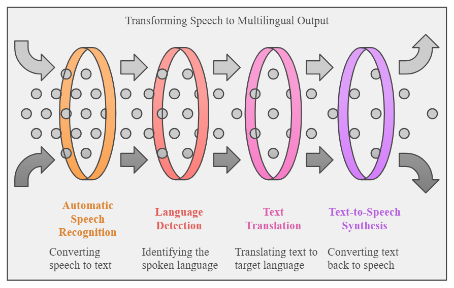
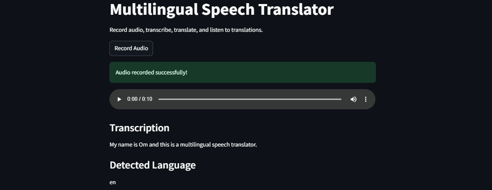

# VocalVerbum: Multilingual Speech Translator

VocalVerbum is a speech-based application that captures audio input, transcribes it, detects the language, translates it into multiple target languages, and provides synthesized speech output in the translated languages. This project aims to facilitate seamless multilingual communication by integrating automated speech recognition, language detection, translation, and text-to-speech technologies.

## Features

1. **Speech Input and Recording**: Capture audio directly within the application.
2. **Automatic Speech Recognition (ASR)**: Convert audio into text using OpenAI’s Whisper model.
3. **Language Detection**: Detect the source language of transcribed text to enable accurate translation.
4. **Multilingual Translation**: Translate the transcribed text into multiple languages with the Helsinki-NLP translation models.
5. **Text-to-Speech Synthesis**: Synthesize the translated text into speech for output in the target languages.

## Tech Stack

- **Programming Language**: Python
- **UI Framework**: Streamlit
- **ASR Model**: Whisper (base model)
- **Translation Models**: Helsinki-NLP/opus-mt models via Hugging Face API
- **TTS Models**: Tacotron2 and HiFi-GAN (for audio synthesis)
- **Environment Configuration**: `.env` file for managing API tokens and settings

## Architecture Diagram



## Setup

1. **Clone the Repository**:

   ```bash
     git clone https://github.com/Om-Shankar-Thakur/Speech-Translator.git
     cd Speech-Translator

   ```

2. **Install Dependencies**:

   ```bash
     pip install -r requirements.txt

   ```

3. **Configure Environment**:
   Create a .env file in the root directory and add your Hugging Face API Token and base URL.

   ```bash
    API_TOKEN=your_hugging_face_token
    API_URL=https://api-inference.huggingface.co/models/

   ```

4. **Run the Application**:
   ```bash
    streamlit run app.py
   ```

## User Interface



## Usage

1. Click on Record Audio to capture your voice for 10 seconds.
2. The application will transcribe your speech, detect the language, translate it to predefined languages, and provide audio playback of each translated output.

## Contributing

Contributions are welcome! Please submit pull requests or issues if you’d like to enhance functionality or suggest improvements.
